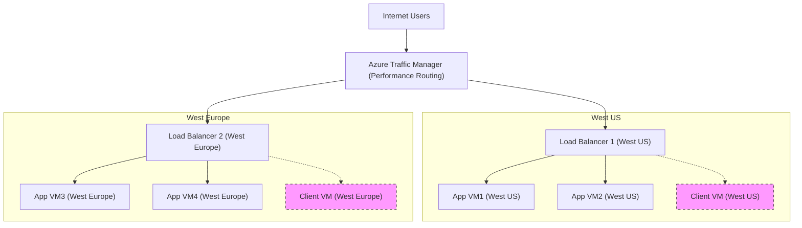

# CLO800P1

This project automates the deployment of a highly available, multi-region Azure infrastructure for CLO800 Project 1 using Terraform.

## Project Overview

- **Regions:** West US and West Europe
- **Resources:**
  - Resource Group (with tags and policy enforcement)
  - Two Virtual Networks (one per region), each with two subnets
  - Four Application VMs (Windows Server 2019, two per region)
  - Two Client VMs (one per region, for RDP access)
  - Two Standard Load Balancers (one per region)
  - Azure Traffic Manager (Performance routing)
  - Network Security Groups (NSGs) for access control
  - Management locks to prevent accidental VM deletion
- **IP Planning:** Uses a personal /24 range, subnetted as required
- **Tagging & Policy:** All resources are tagged and a policy enforces tag compliance

## Architecture Diagram



## Prerequisites

- [Terraform](https://www.terraform.io/downloads.html) >= 1.0
- Azure subscription with sufficient permissions
- [Azure CLI](https://docs.microsoft.com/en-us/cli/azure/install-azure-cli) (for authentication)

## Configuration

1. **Clone the repository** and navigate to the project directory.
2. **Edit `terraform.tfvars`** to set your variables:
   - `student_id` (e.g., "178000238")
   - `personal_ip_range` (e.g., "172.16.135.0/24")
   - `vm_admin_username` (e.g., "kevinadmin")
   - `vm_admin_password` (choose a strong password)
   - `traffic_manager_dns_prefix` (e.g., "kevinwang-mywebapp-trafficmanager")

> **Note:** Never commit sensitive information (like passwords) to public repositories.

## Deployment Steps

1. **Authenticate to Azure:**
   ```sh
   az login
   ```
2. **Initialize Terraform:**
   ```sh
   terraform init
   ```
3. **Review the execution plan:**
   ```sh
   terraform plan
   ```
4. **Apply the configuration:**
   ```sh
   terraform apply
   ```
   - Type `yes` to confirm when prompted.

5. **After deployment:**
   - Outputs will display important information such as:
     - Resource group name
     - Public IPs for load balancers and client VMs
     - Traffic Manager FQDN (use this to access the application)

## Destroying the Environment

To remove all resources created by this project:
```sh
terraform destroy
```
- Type `yes` to confirm when prompted.

## Notes
- IIS installation and web page modification must be performed manually on each VM after deployment.
- Management locks are applied to all VMs to prevent accidental deletion.
- All resources are tagged and comply with the enforced Azure Policy.
- Only the Traffic Manager endpoint is exposed for public access; direct VM public IPs are for management only.

## File Structure
- `main.tf` – Main resource definitions
- `variables.tf` – Input variable definitions
- `outputs.tf` – Output values after deployment
- `terraform.tfvars` – Variable values (user-specific, sensitive)

## Troubleshooting
- Ensure your Azure subscription has sufficient quota for requested resources.
- If you encounter errors, check that all variables in `terraform.tfvars` are set correctly.
- For password or sensitive variable issues, use environment variables or a secure secrets manager if needed.

---

For any questions or issues, please contact the project maintainer.
